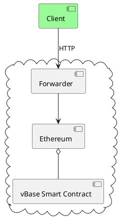
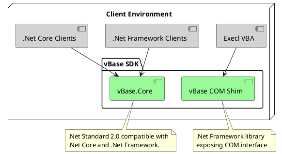
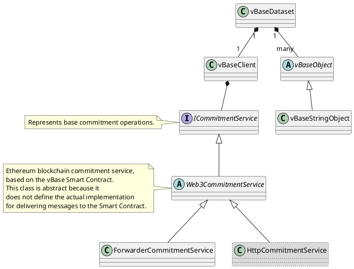

# Abstractions

The software consists of the following components:  

- **Ethereum Blockchain**: Provides verifiable provenance, establishing the credibility of the data.  
- **Validity Base Forwarder API**: A RESTful API that forwards data to the blockchain on behalf of the client.  
- **Validity Base Client**: A client application that interacts with the Forwarder API to send data to the blockchain.  

## Client

The client part consists of the following components:  

- **vBase Core**: The core library that implements communication with the vBase Forwarder API.  
  It is written in .NET Standard 2.0, which makes it compatible with both .NET Core and .NET Framework.  
- **vBase COM Shim**: A COM shim that enables the **vBase Core** library to be used in a COM environment, such as Visual Basic for Applications.  

### vBase Core

The **vBase Core** library implements core vBase client functionality.
It consists of the following main classes and interfaces:

- **ICommitmentService**: Represents base commitment operations.
- **Web3CommitmentService**: Ethereum blockchain commitment service, based on the vBase Smart Contract.
  This class is abstract because it does not define the actual implementation for delivering messages to the Smart Contract.
- **ForwarderCommitmentService**: A vBase Smart Contract commitment service where messages are delivered via the vBase Forwarder.
- **vBaseDataset**: Represents a records set on the blockchain, commited with ICommitmentService.
  It also facilitates validation of the commoted recorded data, ensuring that:
  - Exactly the same data records were commited with the specified timestamps.
  - No additional records were commited within the scope of the dataset.
  - All the records in the dataset were commited.

