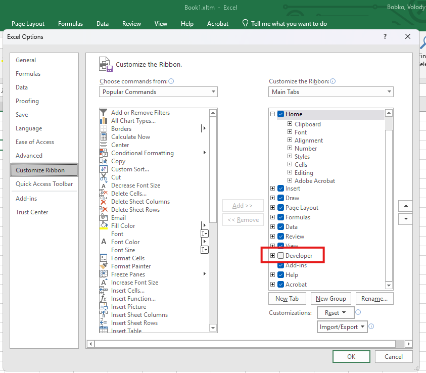

# How to use vBase COM library

1. Uninstall the library if it is already installed on your machine.
2. Install the new version using `setup.exe`.
3. Run Microsoft Excel.
4. Ensure that the 'Developer' ribbon tab is visible. If it is not, enable it in the Excel options:
    1. Right-click on the ribbon and select 'Customize the Ribbon'.
    2. Check the 'Developer' checkbox in the ribbon tabs tree.
       
5. Go to the Developer ribbon tab and click on the 'Visual Basic' button.
6. In Microsoft Visual Basic for Applications, add a reference to the library: **Tools** -> **References** -> find **vBase**.
   
7. The VBA code below demonstrates how to use the library:


```vbnet
Sub BuildAndVerifyDataset()

    On Error GoTo ErrorHandler

    Dim vBaseBuidler As New vBase.vBaseBuilder
    Dim vBaseClient As vBase.vBaseClient
    Dim vBaseDataset As vBase.vBaseDataset
    Dim verificationResult As vBase.verificationResult

    Dim datasetName As String
    Dim forwarderUrl As String
    Dim apiKey As String
    Dim privateKey As String

    datasetName = "<DATASET NAME>"
    forwarderUrl = "<FORWARDER URL>"
    apiKey = "<API KEY>"
    privateKey = "<PRIVATE KEY>"

    Set vBaseClient = vBaseBuidler.CreateForwarderClient(forwarderUrl, apiKey, privateKey)
    Set vBaseDataset = vBaseBuidler.CreateDataset(vBaseClient, datasetName, vBase.ObjectTypes_String)

    vBaseDataset.AddRecord ("<Record 1 Data>")
    ' Add more records
    vBaseDataset.AddRecord ("<Record N Data>")

    Set verificationResult = vBaseDataset.VerifyCommitments()

    MsgBox "Verification passed: " & verificationResult.VerificationPassed

    Exit Sub

ErrorHandler:
    MsgBox "Use [Ctrl+Insert] to copy this message to the clipboard." & vbNewLine & "Error: " & Err.Description, vbCritical

End Sub
```

or

```vbnet
Sub VerifyDataset()

    On Error GoTo ErrorHandler

    Dim vBaseBuidler As New vBase.vBaseBuilder
    Dim vBaseClient As vBase.vBaseClient
    Dim vBaseDataset As vBase.vBaseDataset
    Dim verificationResult As vBase.verificationResult

    Dim forwarderUrl As String
    Dim apiKey As String
    Dim privateKey As String

    datasetName = "<DATASET NAME>"
    forwarderUrl = "<FORWARDER URL>"
    apiKey = "<API KEY>"
    privateKey = "<PRIVATE KEY>"

    Set vBaseClient = vBaseBuidler.CreateForwarderClient(forwarderUrl, apiKey, privateKey)
    Set vBaseDataset = vBaseBuidler.CreateDatasetFromJson(vBaseClient, "<Dataset JSON>")

    Set verificationResult = vBaseDataset.VerifyCommitments()

    MsgBox "Verification passed: " & verificationResult.VerificationPassed
Exit Sub

ErrorHandler:
    MsgBox "Use [Ctrl+Insert] to copy this message to the clipboard." & vbNewLine & "Error: " & Err.Description, vbCritical

End Sub
```
