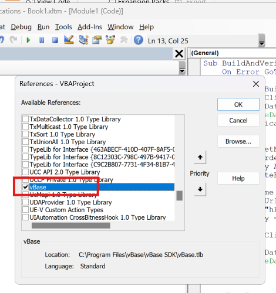

# What Functionality is Covered by the vBase COM Library
This library allows you to create vBase datasets and add records to them. 

Data fetching and preparation must be handled on the VBA side by the end user. The library does not implement any data-fetching capabilities from Excel sheets or other sources.

# How to use vBase COM library

1. Uninstall the library if it is already installed on your machine.
2. Install the new version using the `setup.exe` in the [`vBase COM Setup Files`](https://github.com/validityBase/docs/raw/refs/heads/main/vbase-cs/vBase_Excel_Setup_v11.zip).
3. Run Microsoft Excel.
4. Ensure that the 'Developer' ribbon tab is visible. If it is not, enable it in the Excel options:
    1. Right-click on the ribbon and select 'Customize the Ribbon'.
    2. Check the 'Developer' checkbox in the ribbon tabs tree.
       
5. Go to the Developer ribbon tab and click on the 'Visual Basic' button.
6. In Microsoft Visual Basic for Applications, add a reference to the library: **Tools** -> **References** -> find **vBase**.
   
7. The VBA code below demonstrates how to use the library:


```vbnet
Sub BuildAndVerifyDataset()

    On Error GoTo ErrorHandler

    Dim vBaseBuilder As New vBase.vBaseBuilder
    Dim vBaseClient As vBase.vBaseClient
    Dim vBaseDataset As vBase.vBaseDataset
    Dim verificationResult As vBase.verificationResult
    Dim transactionReceipt As vBase.Web3Receipt

    Dim datasetName As String
    Dim forwarderUrl As String
    Dim apiKey As String
    Dim privateKey As String

    datasetName = "<DATASET NAME>"
    forwarderUrl = "<FORWARDER URL>"
    apiKey = "<API KEY>"
    privateKey = "<PRIVATE KEY>"

    Set vBaseClient = vBaseBuilder.CreateForwarderClient(forwarderUrl, apiKey, privateKey)
    Set vBaseDataset = vBaseBuilder.CreateDataset(vBaseClient, datasetName, vBase.ObjectTypes_String)

    Set transactionReceipt = vBaseDataset.AddRecord ("<Record 1 Data>")
    ' Add more records
    Set transactionReceipt = vBaseDataset.AddRecord ("<Record N Data>")

    MsgBox "Last transaction hash: " & transactionReceipt.transactionHash & vbNewLine & "Last transaction timestamp: " & transactionReceipt.timestamp

    Set verificationResult = vBaseDataset.VerifyCommitments()

    MsgBox "Verification passed: " & verificationResult.VerificationPassed

    Exit Sub

ErrorHandler:
    MsgBox "Use [Ctrl+Insert] to copy this message to the clipboard." & vbNewLine & "Error: " & Err.Description, vbCritical

End Sub
```
