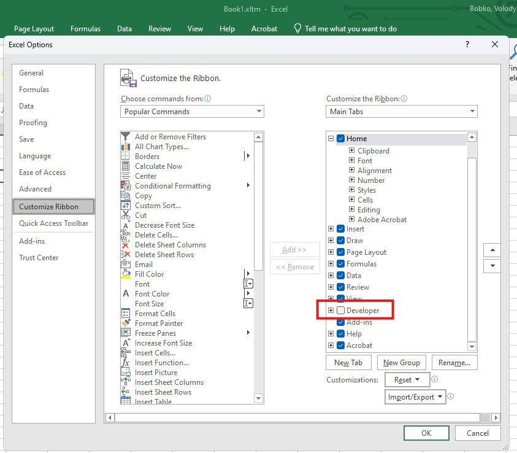
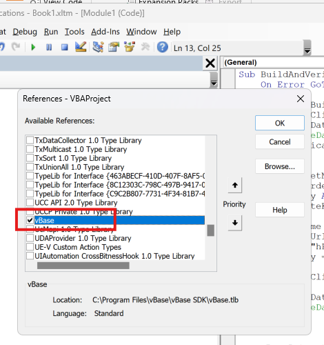

# Using Excel VBA to Create Stamps

The **vBase Excel VBA library** enables you to generate verifiable data and datasets directly from Excel's VBA environment.

The instructions below explain how to create **Stamps** and **Collections** using Excel VBA.


## Installation

1. **[Download the vBase Excel Library Setup Files](https://github.com/validityBase/vbase-cs/releases/download/Excel_Setup_Files/vBase_Excel_Setup_Latest.zip)**.
2. Uninstall any existing version of the library.
3. **Install** the new version by running `setup.exe`.
4. **Open Microsoft Excel**.
5. Ensure the 'Developer' ribbon tab is visible:
    - If it is not, enable it in Excel's options:
        1. Right-click the ribbon and select **Customize the Ribbon**.
        2. Check the **Developer** checkbox.
           
6. **Open the VBA Editor**:
    - Go to the **Developer** tab and click **Visual Basic**.
7. Add a reference to the vBase library:
    - In the VBA Editor, navigate to **Tools** → **References**.
    - Find and select **vBase**.
      
8. Insert a new module:
    - In the VBA Editor, go to **Insert** → **Module**.
9. Copy and paste the sample VBA code (provided below) into the new module.


## VBA Sample Stamping Code

The VBA code below demonstrates how to use the vBase library. Copy and paste it into an Excel VBA module to get started.

```vba
Sub BuildDataset()

    On Error GoTo ErrorHandler

    Dim vBaseBuilder As New vBase.vBaseBuilder
    Dim vBaseClient As vBase.vBaseClient
    Dim vBaseDataset As vBase.vBaseDataset
    Dim verificationResult As vBase.VerificationResult
    Dim transactionReceipt As vBase.Web3Receipt

    Dim datasetName As String
    Dim forwarderUrl As String
    Dim apiKey As String
    Dim privateKey As String

    datasetName = "<DATASET NAME>"
    forwarderUrl = "<FORWARDER URL>"
    apiKey = "<API KEY>"
    privateKey = "<PRIVATE KEY>"

    ' Create a client and dataset
    Set vBaseClient = vBaseBuilder.CreateForwarderClient(forwarderUrl, apiKey, privateKey)
    Set vBaseDataset = vBaseBuilder.CreateDataset(vBaseClient, datasetName, vBase.ObjectTypes_String)

    ' Add records to the dataset
    Set transactionReceipt = vBaseDataset.AddRecord("Test Data 1")
    ' Add more records as needed
    Set transactionReceipt = vBaseDataset.AddRecord("Test Data 2")

    ' Display the last transaction details
    MsgBox "Last transaction hash: " & transactionReceipt.transactionHash & vbNewLine & _
           "Last transaction timestamp: " & transactionReceipt.timestamp

    ' Verify the dataset commitments
    Set verificationResult = vBaseDataset.VerifyCommitments()

    MsgBox "Verification passed: " & verificationResult.VerificationPassed

    Exit Sub

ErrorHandler:
    MsgBox "Use [Ctrl+Insert] to copy this message to the clipboard." & vbNewLine & _
           "Error: " & Err.Description, vbCritical

End Sub
```


## Verification

Verification of Stamps and Collections inside the VBA environment is not currently supported. Please use our Python SDK or [https://app.vbase.com/verify](https://app.vbase.com/verify) to verify the Stamps made via VBA.
